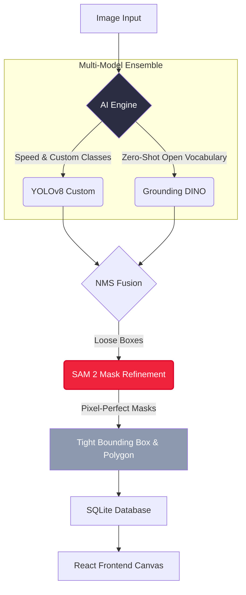

<div align="center">
  
  
  <h1>🐠 Marine Annotation Studio (Annotra)</h1>
  <p><strong>A high-performance, local-first annotation platform for marine datasets with multi-model AI inference pipelines.</strong></p>
  
  [](https://www.python.org/)
  [](https://fastapi.tiangolo.com/)
  [](https://react.dev/)
  [](https://www.electronjs.org/)
  [](LICENSE)
</div>

<hr/>

## 📖 Overview

Marine Annotation Studio (Annotra) is a specialized, offline-capable desktop application built for researchers and data scientists to rapidly annotate massive marine biology datasets. By fusing zero-shot text-prompted detection models (Grounding DINO) with pixel-perfect segmentation (SAM2) and custom YOLO models, the platform drastically accelerates the creation of high-fidelity ground truth data.

### ✨ Key Features
- 🚀 **Local-First Architecture:** Index and process 100k+ images directly from your hard drive with zero cloud upload latency.
- 🧠 **Multi-Model AI Pipeline:** Fuses **YOLOv8** (speed), **Grounding DINO** (zero-shot text prompts), and **SAM 2** (pixel-perfect polygon masks).
- ⚡ **Multi-Threaded Batch Annotation:** Fire-and-forget batch processing. Distribute heavy AI workloads across up to 16 threads for massive time savings.
- 🎨 **Konva-based Canvas:** Smooth zooming, panning, and polygon editing with full Undo/Redo support.
- 💾 **Universal Export Formats:** Export directly to YOLO, COCO, Pascal VOC, CSV, or save labeled image masks.

---

## 🏗 Architecture & AI Pipeline

Annotra utilizes a sophisticated model-ensemble pipeline to ensure every annotation is accurate, bounding boxes are tight, and polygons strictly adhere to the biological boundaries of the subject.



### 🧠 How the Pipeline Works:
1. **Parallel Inference**: The image is fed to both a custom YOLO model (for known species like Butterflyfish) and Grounding DINO (for unknown/zero-shot prompts like "Catla" or "Humphead Wrasse").
2. **NMS Fusion**: Non-Maximum Suppression (NMS) resolves overlapping boxes, prioritizing high-confidence tight boxes while preserving zero-shot loose boxes.
3. **SAM 2 Shrink-Wrap**: The fused boxes are sent as prompts to the Segment Anything Model 2 (SAM 2). SAM 2 generates precise masks and updates the bounding boxes to perfectly wrap the segmented pixels.
4. **Serialization**: The final polygons and tight coordinates are synchronized to the SQLite database and rendered on the React canvas.

---

## 🚀 Quick Start

### Prerequisites
- Node.js v18+
- Python 3.11+
- Git

### 1. Installation

Clone the repository and install the full stack dependencies:
```bash
git clone https://github.com/Rahul9969/Annotra.git
cd marine-annotation-studio
npm run install:all
```

### 2. Configure Environment

Ensure your AI models (`best.pt`, `sam2.1_b.pt`) are placed in the `backend/` directory. Check the `.env` configuration (specifically to enable/disable fast batch processing).

### 3. Run Development Server

```bash
npm run dev
```
This single command concurrently spawns:
- 🐍 **FastAPI Backend:** `http://127.0.0.1:8765`
- ⚛️ **Vite Frontend:** `http://127.0.0.1:5173`
- 🖥️ **Electron Shell**

---

## ⚙️ Usage & Shortcuts

Use the AI Engine settings inside the app to toggle pipeline features like **SAM2 Refinement** and set custom **Confidence Thresholds**. Your settings automatically cascade down to the multi-threaded Batch Runner.

| Key | Action |
|:---:|:---|
| <kbd>B</kbd> | Draw Bounding Box |
| <kbd>V</kbd> | Select Tool |
| <kbd>S</kbd> | Smart Box (SAM 2 Prompt) |
| <kbd>Ctrl</kbd>+<kbd>Z</kbd> | Undo |
| <kbd>Ctrl</kbd>+<kbd>Shift</kbd>+<kbd>A</kbd> | Auto-Annotate Current Image |
| <kbd>Ctrl</kbd>+<kbd>Shift</kbd>+<kbd>B</kbd> | Run Batch Job |
| <kbd>[</kbd> / <kbd>]</kbd> | Previous / Next Image |
| <kbd>F</kbd> | Fit Canvas to Screen |
| <kbd>Del</kbd> | Delete Selected Annotation |

---

## 🛠 Advanced Configuration

Annotra supports deep configuration via the `backend/.env` file. 

**Batch Processing Configuration:**
```env
# Bypass fast-chunking for pixel-perfect per-image parity with Auto Mode
MARINE_BATCH_USE_LEGACY_PIPELINE=true
MARINE_BATCH_FAST_MODE=false

# Global AI Switches
MARINE_ENABLE_GROUNDING_DINO=true
MARINE_ENABLE_SAM2=true
```

## 📜 License
This project is licensed under the MIT License. See the [LICENSE](LICENSE) file for more details.
